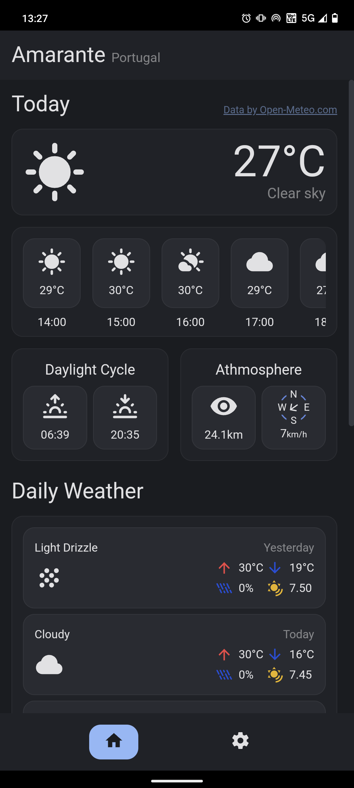
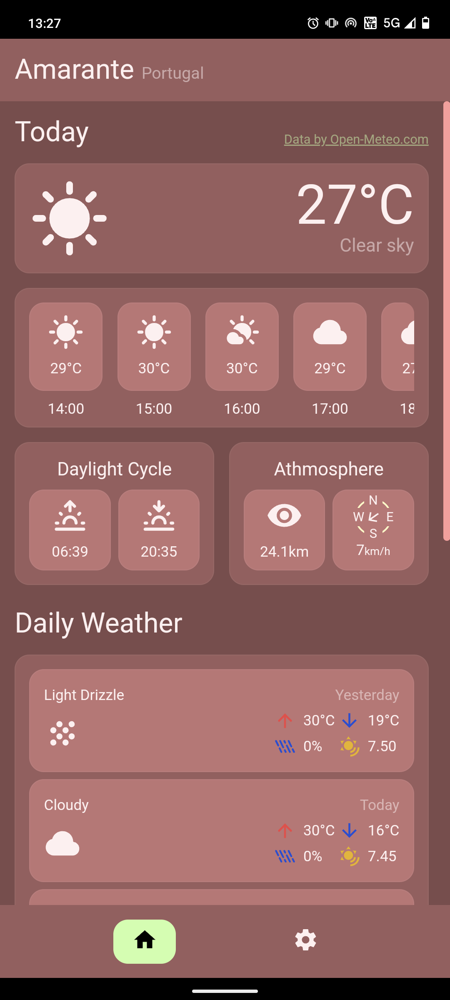
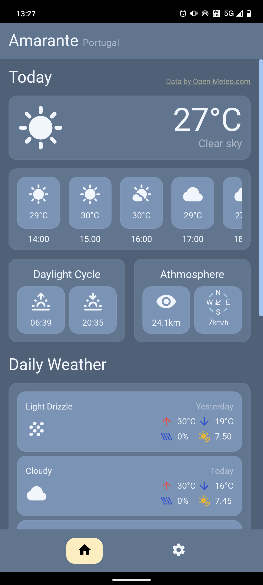
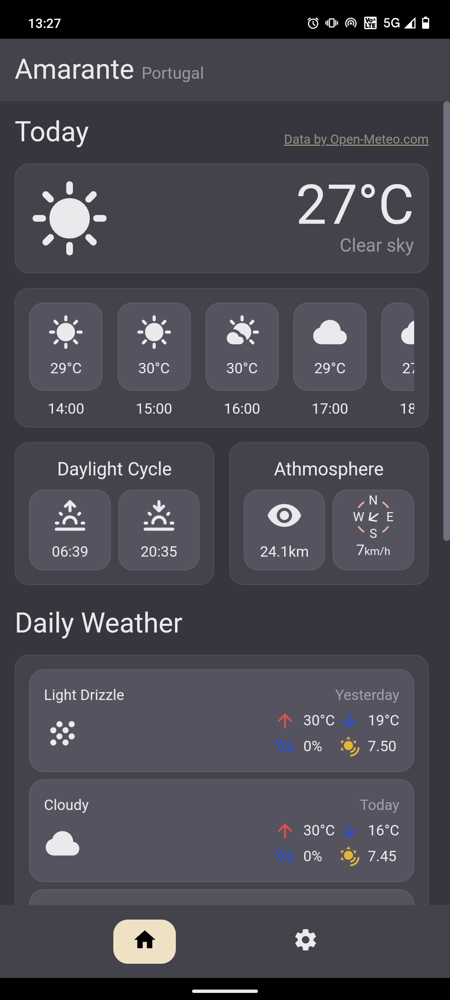
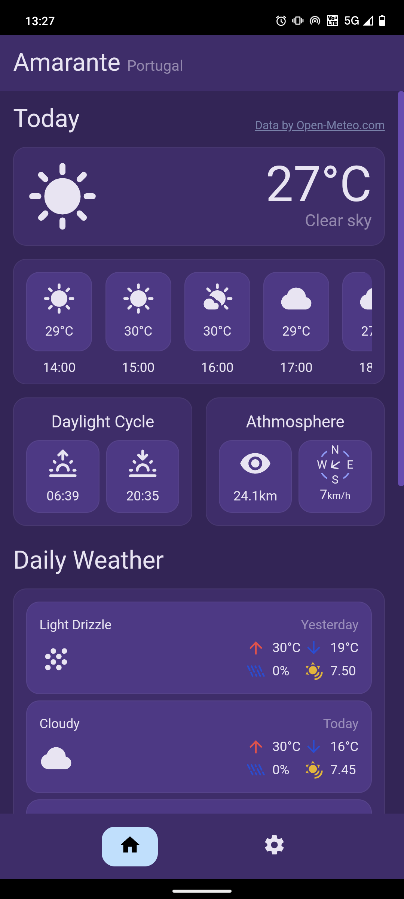
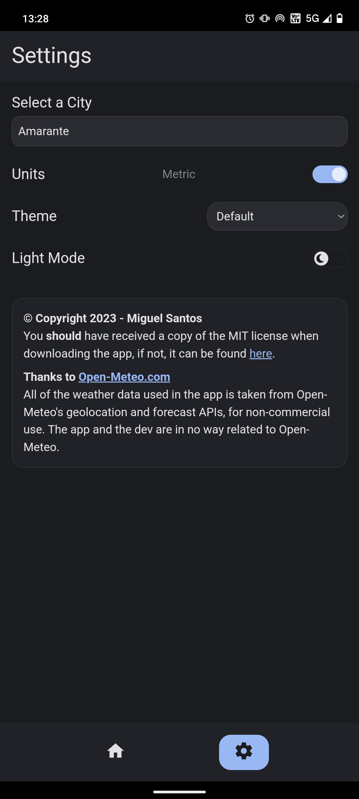

# SkyMuse

SkyMuse is an simple FOSS Android Weather App with all the info you'll ever need, built with Svelte, using Open-Meteo's APIs, Skeleton UI and TailwindCSS.

## Why use SkyMuse?

SkyMuse is simple, easy and fast. Built with privacy in mind, SkyMuse will NOT use nor collect any of your data for any other purpose than the core functionality of the app.
Due to this, SkyMuse was designed in a way that you MUST input your location manually, made easy by the use of a search feature in the settings.

### Themes!

## Download

I probably set up a releases tab, try checking that. If not, it's under: /android/app/release/app-release.apk

## To Do's

[ ] Add Daily Notifications

[ ] More Weather Cards

[ ] Fix design on some devices

[ ] Add initial setup screen